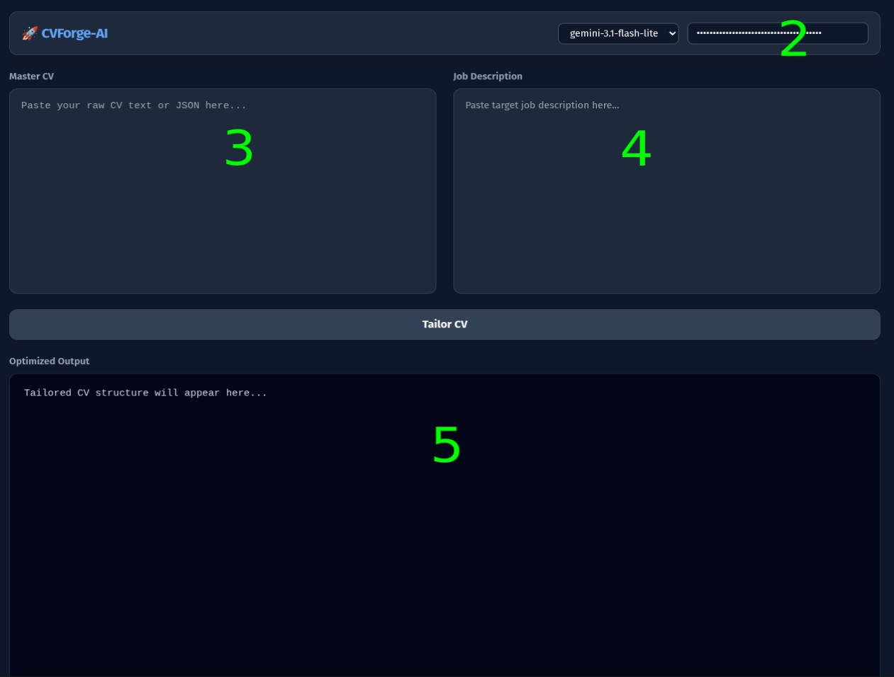

# CVForge-AI

A lightweight tool to adapt your professional CV to specific job requirements using AI. This app was created to support people looking for jobs and uses GEMINI AI models, so it is not adapted for others. If you'd like to expand it, let me know. Long live open source!!!

## Setup

### Backend (Proxy)


1. Ensure Python is installed.

2. Create virtual environment:

```bash
python3 -m venv .venv
```
3. Run comend in folder with ```.venv```
```bash
Linux - POP!_OS
source .venv/bin/activate
```
```
Windows 10/11
.venv\Scripts\activate
```


3. Install dependencies: pip install fastapi uvicorn httpx

4. Run proxy: uvicorn server:app --reload --port 9999

### Frontend


1. Open CVForge-AI.html in any modern browser.

2. Enter your Gemini API key in the UI.

3. Edit your master CV JSON in the left panel (example file is in mine root)

4. Paste the target job description in the middle panel.

5. Generate the optimized CV text in Markdown.

